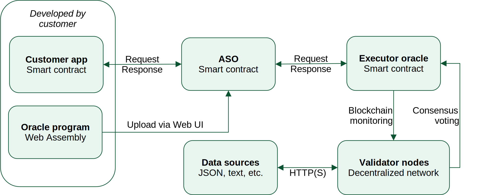

##############################
App-specific Oracles with Gora
##############################

App-specific oracle (*ASO*) is an oracle designed to serve a certain web3
application or application type. While a general-purpose oracle strives for
maximum flexibility to support all kinds or applications, it may lack
specialized data processing or access control features needed for more niche use
cases.

For example, a sports oracle may want to provide team statistics which requires
getting data from several resources and performing floating-point maths on it. A
private oracle may want to only serve specific smart contracts or authenticate
itself to data sources in a bespoke way.

Gora provides accesible and flexible tools to create your own ASO's and deploy
them to EVM-compatible blockchains of your choice: either public, like Base or
Polygon, or private, which organizations can run internally. Gora does this by
combining its tried and true general-purpose oracle architecture with a powerful
off-chain computation engine.

Rather than simply fetching data online and passing it on for verification, for
ASO requests Gora nodes execute *oracle programs*: tiny pieces of software that
implement customizations and extensions to oracle functionality. Oracle programs
are created by customers deploying ASO's. For simpler cases, this can be done
without programming using Gora web-based code generation tool. When higher
levels of customization are required, oracle programs are written explicitly in
C or any language that compiles to Web Assembly.

***********************************
Gora ASO architecture and workflow
***********************************

Gora's app-specific oracle relies on two key mechanisms: an ASO smart contract
and an *executor* oracle. ASO smart contract contains oracle program and custom
configuration required by customer for their specific use case. An executor
oracle is a generic and complete oracle engine that implements fundamental
oracle functionality such as distributed node management and consensus
verification. They work together to serve web3 application requests as follows:

* An application smart contract makes a request for an oracle value. It calls
  the ASO smart contract, providing request parameters (if any) and expects a
  call back with a response.

* ASO smart contract combines received parameters with its configuration
  settings and oracle program, making a request to the executor oracle.

* Request to the executor oracle is picked up by decentralized network of nodes.
  Each online node runs the oracle program provided by the ASO smart contract.
  The program queries online data sources, processes received data, performs
  other programmed operations as needed to produce an oracle value.

* The produced value is submitted by each node to the executor smart contract
  for a proof-of-stake consensus verification. Upon reaching the configured
  threshold, the executor contract calls back ASO smart contract with the
  response. The ASO smart contract forwards the response to the application
  smart contract.

Gora provides common shared executors on a number of popular public blockchain
networks. ASO customers just starting out are advised to use these. When data
privacy, extra computing power or control over staking tokenomics is desired,
customers are welcome to setup their own executors using Gora software. ASO
smart contract can switch executors at any time.

***************************
Creating and managing ASO's
***************************

Application-specific oracles are created using Gora's web-based `ASO control
panel <https://aso.gora.io/>`_ To start using it, connect your Web3 wallet by
clicking "Connect Wallet". If you already created ASO's using this wallet
account, you will be able to choose one from the drop-down list. You will also
see a "Create new" clicking it will create a new ASO for you.

.. warning:: Creating or updating ASO's on a public mainnet generates blockchain
             transactions that cost real money. For trying things out free of
             charge, we suggest using a public testnet, such as Base Sepolia.
             Before doing that, you would need to make sure you have some
             testnet ETH in your wallet account. You should be able to get some
             via a public web faucet for the chosen network.

Once you create a new ASO by clicking "Create new" button, or select an existing
one in the dropdown list, you will be presented with ASO configuration form.
It contains properties of the currenty selected ASO for you to edit.

.. warning:: ASO configuration property values are stored on the blockchain, so
             the larger they are, the more it will cost. Oracle program source
             code property is for customer information only, it can be left
             empty on a mainnet to reduce storage cost.

Configuration form fields and their meanings are as follows:

ASO contract
  Address of the ASO contract being configured

Description
  Short string describing the ASO, e.g. "Footbal player rating"

Own fee
  Amount in blockchain native currency that must be paid by the calling smart
  contract to make a request to the ASO. Specified as whole number with regard
  to number of decimals used by the blockchain for its currency. E.g. `Base
  <https://base.org/>`_ like most EVM-based blockchains use 18 decimals, so to
  charge ``0.0001`` Base ether, set this to ``100000000000000``.

Executor
  Address of the executor oracle smart contract that the ASO will forward its
  requests to. This should default to Gora shared executor address on the
  current blockchain. Should you need to reset it, see addresses in `Shared Gora
  executors <#shared-gora-executors-2>`_ section. Customer using their own
  custom executor network will need to enter its address here.

Maxium executor fee
  Highest amount that the ASO is allowed to pay for an executor oracle request.
  Executor request price is defined by the executor and can be fixed or varying
  to accomodate for market volatility. Setting maximum executor fee allows to
  prevent ASO losing money: if the executor fee goes higher, ASO will decline
  requests. `Shared Gora executors <#shared-gora-executors-2>`_ section contains
  their respective pricing info. Customers with a custom executor will have set
  its pricing when they had deployed it. Every executor will also set the asset
  in which it will be paid - an ERC20 token or native currency. This asset will
  be auto-detected by the ASO, so it does not need to be configured here.

Source code
  Source code for the oracle program - piece of software that queries data
  sources and produces an oracle value. This field is for *for customer
  reference only* and is not used by ASO. It may be best to leave it empty on
  mainnet blockchain networks for privacy and cost saving. It is primarily
  intended for development use on public testnets or local blockchain networks.

Compiled binary
  Oracle program in compiled (binary form). This field can be populated by
  compiling source code in the above field after pressing "Compile".
  Alternatively, users can upload their Web Assembly binaries converted to a hex
  string, optionally compressed with ``gzip``.

************************************
Oracle programs: writing and testing
************************************

An ASO oracle program is a compact piece of software that queries online data
sources and produces an oracle value. Any ASO has to have an oracle program to
function, and usually it is written specifically for this ASO. While Gora ASO
programs can be written in any language that compiles to Web Assembly, the ASO
control panel and documentation examples use C language. It is simple,
ubiquitous and can create very compact executables suitable for storage on the
blockchain.

============================================
Entering and compiling progams with examples
============================================

No software installation is required to work with oracle programs: they can be
written, compiled, tested and deployed inside ASO web control panel. To get
started, click "Insert example" button under the program source code field in a
newly created ASO. The field (which must previously be empty) will be filled
with a basic C program that always returns string ``"Hello Gora!"`` as the
oracle value. Clicking "Compile" button will compile this program and populate
the compiled binary field.

================
Testing programs
================

ASO contol panel allows to test oracle programs before they are deployed to the
blockchain. Pressing "Test oracle" button under the "Test" section will trigger
compilation (when source code is present) and execution of the current oracle
program. Click it to run the test and check out the result placed in "Test
result" read-only field. For programs that take arguments, the field "Program
arguments (JSON)" is populated with a JSON-formatted array. In a production
environment, these arguments would come from ``args`` parameter of the
``request()`` method call to ASO smart contract.

========================
Gora oracle programs API
========================

Oracle programs are executed by Gora nodes in a customized Web Assembly
environment. They interact with the host node via *Gora off-Chain API* that
provides functionality to query data sources, fetch results, write log messages
and more. Another essential part of this API is support for repeated program
execution in the same request context. This is necessary because Web Assembly
programs cannot efficiently pause while waiting to receive data, such as from
online sources.

~~~~~~~~~
Functions
~~~~~~~~~

Gora off-chain API is made available to C programs by including
``gora_off_chain.h`` header file. When compiling via ASO control panel, it is
made available for inclusion automatically. It defines the following custom
functions:

``void gora_request_url(const char* url, const char* value_specs)``
  Request data from an URL. ``value_specs`` argument contains one or more
  `value extraction specifications <#value-extraction-specifications>`_,
  separated by tab characters. For their syntax, see the dedicated section below.

``void gora_set_next_url_param(const char* value)``
  Set value of a template parameter in the URL last requested with
  ``gora_request_url()``. For example, after requesting the URL
  ``https://example.com/?a=##&b=##``, one can call
  ``gora_set_next_url_param("one")``, then ``gora_set_next_url_param("two")``,
  yielding the URL ``https://example.com/?a=one&b=two``. This allows to have
  predefined templates for data source URLs and fill them at runtime.

``void gora_log(const char* message, const int level)``
  Write a message to the node log. Intended for debugging only, oracle
  program logging is disabled by default on production nodes.

~~~~~~~~~~~~~~~~~
Context structure
~~~~~~~~~~~~~~~~~

In addition to functions, Gora off-Chain API defines a *context* data structure
It is designed for passing data from host node to oracle program as well as
preserving current state between execution *stages* (more on that later). An
instance of this structure is passed to oracle program whenever it executes.
It contains:

* API version information for compatibility checks
* Arguments passed to the program with the oracle request
* Values from queried data sources extracted by host for the program
* Oracle value to be returned, set by the program
* Current execution stage number
* Scratch memory for program data to persist between execution stages

Complete definition of the context structure is contained in
``gora_off_chain.h`` header file which all oracle program developers are advised
to peruse.

~~~~~~~~~~~~~~~~
Staged execution
~~~~~~~~~~~~~~~~

Like most low-level system languages, Web Assembly, which oracle programs are
compiled to, does not support asynchronous calls. When a Web Assembly program
needs to retrieve data from a source that cannot return it instantly (e.g. a
network endpoint), it has to either constantly check for data arrival in a loop
(very inefficient) or rely on runtime environment to call it when the data is
ready.

Gora off-chain API implements a variant of the second approach. It executes the
program repeatedly, performing asynchronous operations between executions which
are called *stages*. A *stage* starts when program's *main function* is called
by the host node and ends when this function returns. During a stage, the
program can schedule HTTP(S) requests, possibly using URL templates that it can
fill at run time. When a stage ends, these requests are executed by the host
node. On their completion, next stage commences and request results are made
available to the program via the context structure. The context contains current
stage number, so program always knows which stage it is at. It also has
persistent memory space to share data between stages. Finishing a stage, the
program's main function returns a value telling the host node what to do next:
execute the next stage, finish successfully or terminate with a specific error
code. For a hands-on primer of using staged execution, please see example ASO
progams.

===============================
Value extraction specifications
===============================

Oracle users most often want a specific piece of data source output, so they
must be able to tell Gora how to extract it. This is what a *value extraction
specification* does. It consists of up to three parts, separated by colons:
method, expression and an optional rounding modifier. For example, `substr:4,11`
tells Gora that it needs to return a substring from data source output, starting
at 4th and ending at 11th character.

Gora supports the following value extraction methods and expression formats:

jsonpath
  | JSONPath expression, see: https://datatracker.ietf.org/doc/draft-ietf-jsonpath-base/
  | Example: ``jsonpath:jsonpath:$.data.temperature``

xpath
  | XPath expression, see: https://www.w3.org/TR/2017/REC-xpath-31-20170321/
  | Example: ``xpath:/p/a``

regex
  | JavaScript regular expression, see: https://developer.mozilla.org/en-US/docs/Web/JavaScript/Guide/Regular_Expressions
  | Example: ``regex: the magic number is ([0-9]+)``

substr
  | Substring specification, start and end offsets, e.g. `substr:4,11`
  | Example: ``substr:0,10``

bytes
  | Same as substring specification, but operates on bytes rather than characters
  | Example: ``bytes:2,4``

An optional rounding modifier is used to round floating-point values to certain
amount of digits after the point. This may be necessary with some types of
values such as cryptocurrency exchange rates. They can be so volatile that
different Gora nodes are likely to get slightly different results despite
querying them at almost the same time. That would prevent the nodes from
achieving consensus and confirming the value as authentic. Adequate rounding
gets us around this issue.

For instance, if you specify ``jsonpath:$.rate:3``, the responses
``{ "rate": 1.2344 }`` and ``{ "rate": 1.2342 }`` that may be received by
different Gora nodes will yield the same value ``"1.234"``. The nodes will
achieve consensus and you will get ``"1.234"`` as the resulting oracle value.

Rounding only affects fractional part of the rounded number, all whole part
digits are preserved.  For example, if rounding parameter is set to ``4``, the
number ``1.12345`` will be rounded to ``1.1234``; but, for exmaple, the number
``12345678`` will remain unaffected.

******************************************************
Using app-specific oracles from your smart contracts
******************************************************

TODO:
 - Request cycle flow diagram

Gora app-specific oracles work using a simple callback pattern. To make an
oracle request, customer smart contract calls ASO smart contract's ``request``
method.  If parameters need to be passed to the oracle program, they are
supplied as the method argument (array of byte strings). Unique request ID is
returned by ASO for future reference. On successful request completion, customer
smart contract gets a response call to its special ``__goraAsoResponse`` method
from the same ASO smart contract. The call has two arguments: request ID to
match the response to the initiated request, and the actual value returned by
the oracle.

To get a feel of it, consider the following contrived Solidity fragment that
might occur in a smart contract tracking Bitcoin price and DowJones Industrial
Average index:

.. code:: solidity
  :number-lines:

  // ASO smart contracts to query, addresses will be known and chain-specific.
  GoraAso rateAso(0xaaaaaaaaaaaaaaaaaaaaa);
  GoraAso dowJonesAso(0xbbbbbbbbbbbbbbbbbbbbb);

  // Local storage to track requests in flight.
  enum RequestType { None, BitcoinPrice, DowJones };
  mapping(bytes32 => RequestType) requests;

  // Values to keep up to date. Byte strings for simplicity, but in
  // real-world apps these are usually unpacked into more suitable formats.
  bytes bitcoinPrice;
  bytes dowJones;

  // Request a Bitcoin price update.
  function requestBitcoinPrice() external {
    bytes[] memory reqParams = new bytes;
    reqParams[0] = bytes("btc");
    reqParams[1] = bytes("usd");
    bytes32 reqId = rateAso.request(reqParams);
    requests[reqId] = RequestType.BitcoinPrice;
  }

  // Request a Dow Jones index update.
  function requestDowJones() external {
    bytes32 reqId = dowJonesAso.request(new bytes);
    requests[reqId] = RequestType.DowJones;
  }

  // Handle oracle responses.
  function __goraAsoResponse(bytes32 reqId, bytes calldata value) external {
    if (requests[reqId] == RequestType.BitcoinPrice)
      bitcoinPrice = value;
    else if (requests[reqId] == RequestType.DowJones)
      dowJones = value;
    else
      revert("Response to an unknown request");
    delete requests[reqId];
  }

For complete working examples demonstrating uses of Gora ASO, please
see this repository.
TODO: link to examples repo/dir

 - ASO Solidity examples (to be written)

****************
Executor oracles
****************

TODO:
 - Incorporate docs from "classic" Gora as the explanation of executors.

================
Shared executors
================

Gora provides shared executors for ASO customer use. These are essentially
generic oracles relying on a decentralized network of nodes for data querying
and validation. Node operators use Gora tokens to make stakes for proof-of-stake
valudation and to receive rewards for fulfilling oracle requests. Customers
using a shared Gora executor must therefore fund their ASO smart contract with
Gora tokens and maintain their balance as they are being spent.

To use a Gora shared executor, set your ASO executor address according to
network being used:

=====================  ============  ============  ============
Blockchain Network     Address       Fee asset     Fee amount
=====================  ============  ============  ============
Base Sepolia           TODO          TODO          TODO
Base Mainnet           TODO          TODO          TODO
Polygon Testnet        TODO          TODO          TODO
Polygon Mainnet        TODO          TODO          TODO
=====================  ============  ============  ============

When using a testnet, visit `Gora testnet faucet <https://dev.gora.io/faucet>`_
to get tokens for funding your ASO contract.

================
Custom executors
================

Shared executors rely on distributed networks of nodes run by general public.
This may not be suitable for certain use cases: for example, when private data
(such as keys) is used for querying data sources, or when oracle programs use
exceptionally large amounts of resources.

For these kinds of situations, Gora provides a way for customers to deploy their
own executors. Once customer deploys an executor smart contract, they can bring
up a separate node network under their own management. Standard Gora node
software which can work with private authentication keys can be used, or Gora
can develop customized Gora node versions for customer's specific needs.

At this time, creating custom executors is a semi-manual process, with a
completely automated tool being on the roadmap. If you would like to explore
this option, please contact Gora.
