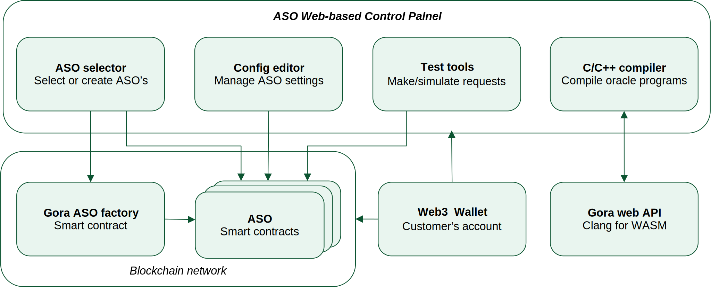

#############################
App-specific Oracles (ASO's)
#############################

App-specific oracles (*ASO*'s) are Gora's response to recent market demands.
These are oracles designed to serve a certain web3 application or application
type. While a general-purpose oracle strives for maximum flexibility to support
all kinds or applications, it may lack specialized data processing or access
control features needed for more niche use cases. For example, a sports oracle
may want to provide team statistics which requires getting data from several
resources and performing floating-point maths on it. A private oracle may want
to only serve specific smart contracts or authenticate itself to data sources in
a bespoke way.

.. table::
  :class: comparison

  ================================ ======================= ========================
  Feature                          General-purpose oracle  App-specific oracle
  ================================ ======================= ========================
  Ease of use                      *Moderate*              *High*
  Customizability                  *Low*                   *High*
  Restrictions on data sources     *Not supported*         *Up to ASO owner*
  Restrictions on users            *Not supported*         *Up to ASO owner*
  Third-party monetization         *Not supported*         *Via ASO owner's fee*
  Failover capability              *None*                  *Via multiple executors*
  ================================ ======================= ========================

Gora provides accesible and flexible tools to create your own ASO's and deploy
them to EVM-compatible blockchains of your choice: either public, like Base or
Polygon, or private, which organizations can run internally. Gora does this by
combining its tried and true general-purpose oracle architecture with a powerful
off-chain computation engine. Rather than simply fetching data online and
passing it on for verification, Gora ASO requests execute *oracle programs*:
tiny pieces of software that implement customizations and extensions to oracle
functionality. Oracle programs can be easily created by customers deploying
ASO's using programming languages of their choice.

******************************
ASO architecture and workflow
******************************

.. figure:: aso_arch.svg
   :width: 800
   :align: left
   :alt: Gora ASO architecture and workflow diagram

   Gora ASO architecture and workflow diagram

Gora's app-specific oracles rely on two key mechanisms: an ASO smart contract
and an *executor* oracle. ASO smart contract contains oracle program and custom
configuration required by customer for their specific use case. An executor
oracle is a generic and complete oracle engine that implements fundamental
oracle functionality using a distributed node network and consensus verification.
They work together to serve web3 application requests as follows:

#. An application smart contract makes a request for an oracle value by calling
   the ASO smart contract. It provides request parameters (if any) and expects a
   call back with a response.

#. ASO smart contract combines received parameters with its configuration
   settings, its oracle program and makes a request to the executor oracle.

#. Request to the executor oracle is picked up by decentralized network of nodes.
   Each online node runs the oracle program provided by the ASO smart contract.
   The program queries online data sources, processes received data and performs
   other programmed operations as needed to produce an oracle value.

#. The produced value is submitted by each node to the executor smart contract
   for a proof-of-stake consensus verification. Upon reaching the configured
   threshold, the executor contract calls back ASO smart contract with the
   response. The ASO smart contract forwards the response to the application
   smart contract.

Gora provides common shared executors on a number of popular public blockchain
networks. ASO customers just starting out are advised to use these. When data
privacy, extra computing power or control over staking tokenomics is desired,
customers are welcome to setup their own executors using Gora software. ASO
smart contract can switch executors at any time.

***************************
Creating and managing ASO's
***************************

Gora application-specific oracles are normally created and updated using Gora's
web-based *ASO control panel*. It provides a user-friendly way to handle all
aspects of ASO's, including compiling oracle programs and testing them.

   Gora web-based control panel in ASO architecture

To start using Gora ASO control panel, go to https://aso.gora.io/ and connect
your Web3 wallet by clicking "Connect Wallet". If you already created ASO's
using the account selected in your wallet, you will be able to choose one from
the drop-down list. You will also see a "Create new" button clicking which will
make a new ASO for you.

.. warning:: **WARNING** Creating or updating ASO's on a public mainnet
             generates blockchain transactions that cost real money. For trying
             things out free of charge, we suggest using a public testnet, such
             as Base Sepolia. Before doing that, ensure your wallet account has
             some testnet ETH which you can get via a public web faucet for the
             chosen network.

Once you create a new ASO by clicking "Create new" button or select an existing
one in the dropdown list, you will be presented with the ASO control panel.
It contains properties of the currenty selected ASO for you to edit.

.. warning:: **WARNING** ASO configuration property values are stored on the
             blockchain, so the larger they are the more it will cost. Do not
             populate them if you don't need them. For example, Oracle program
             source code property is for customer information only and should
             generally be left empty on a mainnet.

Control panel entry fields and their meanings are as follows:

ASO contract
  Address of the ASO contract being configured

Description
  Short string describing the ASO, e.g. "Footbal player rating"

Own fee
  Amount in blockchain native currency that must be paid by the calling smart
  contract to make a request to the ASO, e.g. ``0.0012``.

Executor
  Address of the executor oracle smart contract for the ASO to use. This should
  default to Gora shared executor address on this blockchain. A customer using
  their own custom executor will need to enter its address here.

Maxium executor fee
  Highest amount that the ASO is allowed to pay for an executor oracle request.
  Executor request price is defined by the executor and can be fixed or varying
  to accomodate for market volatility. Empty field means no limit. Setting
  maximum executor fee allows to prevent ASO losing money: if the executor fee
  goes higher, ASO will decline requests. Every executor will also set the asset
  in which it will be paid - an ERC20 token or native currency. This asset will
  be auto-detected by the ASO, so it does not need to be configured here.

Source code
  Source code for the oracle program - piece of software that queries data
  sources and produces an oracle value. This field is for *for customer
  reference only* and is not used by ASO. It may be best to leave it empty on
  mainnet blockchain networks for privacy and cost saving. Its primary purpose
  is convenience while developing on public testnets or local blockchain
  networks.

Compiled binary
  Oracle program in compiled (binary form). This field can be populated
  compiling source code in the above field by pressing "Compile" button.
  Alternatively, users can upload their Web Assembly binaries converted to a hex
  string with optional ``gzip`` compression.

***************
Oracle programs
***************

An ASO oracle program is a compact piece of software that queries online data
sources and produces an oracle value. Any ASO must have an oracle program to
function, and usually it is written specifically for this ASO. While Gora ASO
programs can be written in any language that compiles to Web Assembly, the ASO
control panel and documentation examples use C language. It is simple,
ubiquitous and can create very compact executables suitable for storage on the
blockchain. To learn about oracle program API and control flow, please see
`Gora off-chain computation API <#off-chain-api>`_.

======================
Entering and compiling
======================

No software installation is required to work with oracle programs. They can be
written, compiled, tested and deployed inside ASO web control panel. To get
started, click "Insert example" button in the control panel for a newly created
ASO. The field (which must be empty) will be filled with a basic C program that
returns string ``"Hello Gora!"`` as the oracle value. Clicking "Compile" button
will compile this program and populate the compiled binary field.

=======
Testing
=======

ASO contol panel allows to test oracle programs before they are deployed to the
blockchain. Pressing "Test locally" button will trigger compilation (when source
code is present) and execution of the current oracle program. Click it to run
the test and check out the result placed in the "Log messages" box. For programs
that take arguments, they can be provided "Program arguments (JSON)" field as a
JSON-formatted array. In a production environment, these arguments would come
from ``args`` parameter of the ``request()`` method call to ASO smart contract.

***********
Using ASO's
***********

Gora app-specific oracles work using a simple callback pattern. To make an
oracle request, customer smart contract calls ASO smart contract's ``request``
method.  If parameters need to be passed to the oracle program, they are
supplied as the method argument (array of byte strings). Unique request ID is
returned by ASO for future reference. On successful request completion, customer
smart contract gets a response call to its special ``__goraAsoResponse`` method
from the same ASO smart contract. The call has two arguments: request ID to
match the response to the initiated request, and the actual value returned by
the oracle.

To get a feel of it, consider the following contrived Solidity fragment that
might occur in a smart contract tracking Bitcoin price and DowJones Industrial
Average index:

.. code:: solidity
  :number-lines:

  // ASO smart contracts to query, addresses will be known and chain-specific.
  GoraAso rateAso(0xaaaaaaaaaaaaaaaaaaaaa);
  GoraAso dowJonesAso(0xbbbbbbbbbbbbbbbbbbbbb);

  // Local storage to track requests in flight.
  enum RequestType { None, BitcoinPrice, DowJones };
  mapping(bytes32 => RequestType) requests;

  // Values to keep up to date. Byte strings for simplicity, but in
  // real-world apps these are usually unpacked into more suitable formats.
  bytes bitcoinPrice;
  bytes dowJones;

  // Request a Bitcoin price update.
  function requestBitcoinPrice() external {
    bytes[] memory reqParams = new bytes;
    reqParams[0] = bytes("btc");
    reqParams[1] = bytes("usd");
    bytes32 reqId = rateAso.request(reqParams);
    requests[reqId] = RequestType.BitcoinPrice;
  }

  // Request a Dow Jones index update.
  function requestDowJones() external {
    bytes32 reqId = dowJonesAso.request(new bytes);
    requests[reqId] = RequestType.DowJones;
  }

  // Handle oracle responses.
  function __goraAsoResponse(bytes32 reqId, bytes calldata value) external {
    if (requests[reqId] == RequestType.BitcoinPrice)
      bitcoinPrice = value;
    else if (requests[reqId] == RequestType.DowJones)
      dowJones = value;
    else
      revert("Response to an unknown request");
    delete requests[reqId];
  }

For complete working examples demonstrating uses of Gora ASO, please
see the examples repository.

****************
Executor oracles
****************

Every ASO relies on an executor oracle (*executor*) for basic lower-level
blockchain oracle operations. Separating ASO's and executors allows for more
flexibility, failover capabilities and a seamless customer upgrade path from
shared to private infrastructure. Gora recommends new ASO customers to start
with a shared executor.

.. table::
  :class: comparison

  ================================ ======================= =======================
  Features                         Shared executor         Custom executor
  ================================ ======================= =======================
  Managed by                       Gora                    ASO owner
  Requires setup and configuration No                      Yes
  Private data sources             Not supported           Configurable
  Node software customization      Not supported           Possible
  Node hardware capabilities       Limited                 Up to ASO owner
  Payment options                  GORA token              Any ERC20 token
  ================================ ======================= =======================

================
Shared executors
================

Gora provides shared executors for ASO customer use. These are essentially
generic oracles relying on a decentralized network of nodes for data querying
and validation. Node operators use Gora tokens to make stakes for proof-of-stake
valudation and to receive rewards for fulfilling oracle requests. Customers
using a shared Gora executor must therefore fund their ASO smart contract with
Gora tokens and maintain their balance as they are being spent.

To use a Gora shared executor, set your ASO executor address according to
network being used:

.. table::
  :class: comparison

  =====================  ========================================== ============  ============
  Blockchain Network     Address                                    Fee asset     Fee amount
  =====================  ========================================== ============  ============
  Base Sepolia           0x627e0C53aF5Bb97610A8146F931188FCB43C9B49 GORA          1
  Base Mainnet           0xd4c99F88095F32dF993030d9a6080e3BE723F617 GORA          1
  Polygon Testnet        TBA                                        GORA          1   
  Polygon Mainnet        TBA                                        GORA          1   
  =====================  ========================================== ============  ============

When using a testnet, visit Gora testnet faucet to get tokens for funding your
ASO contract.

================
Custom executors
================

Shared executors rely on distributed networks of nodes run by general public.
This may not be suitable for certain use cases. For example, when private data
(such as keys) is used for querying data sources, or when oracle programs use
exceptionally large amounts of computing resources.

For these kinds of situations, Gora provides a way for customers to deploy their
own executors. Once customer deploys an executor smart contract, they can bring
up a separate node network under their own management. Standard Gora software
which can work with private authentication keys can be used to run it, or Gora
can customize its node software for customer's specific needs.

At this time, creating custom executors is a semi-manual process, with a
completely automated tool being on the roadmap. If you would like to explore
this option, please contact Gora.
