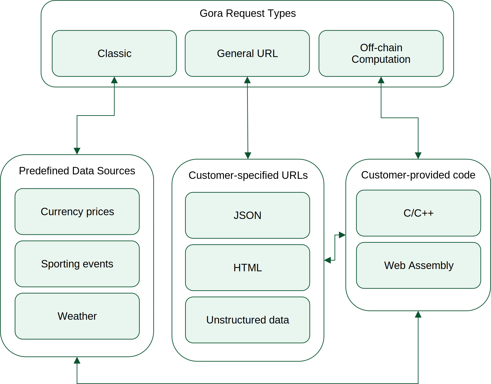

##########################
Classic oracle on Algorand
##########################

Customer applications interact with Gora via smart contract calls. For a quick
hands-on introduction to using Gora from your smart contracts, please see Gora
`Developer Quick Start`_ GitHub repository. For a complete reference and
instructions on calling Gora from JavaScript, read on.

**********************
Requesting oracle data
**********************

Gora requests are made by calling ``request`` method of the main Gora smart
contract. This contract's application ID is a part of Gora network
configuration and can be found using ``info`` command of the Gora CLI tool.
For example (with irrelevant output removed):

.. parsed-literal::
   :class: terminal

   $ ./gora info
   ...
   Main app ID: 439550742
   ...
   $

``request`` method accepts the following arguments:

================ ===================== =================================================
Name             ABI Type              Description
================ ===================== =================================================
``request_args`` ``byte[]``            Encoded request specification
``destination``  ``byte[]``            Encoded destination call specificaiton
``type``         ``uint64``            Request type ID
``key``          ``byte[]``            Unique request key
``app_refs``     ``uint64[]``          App references to pass through to destination
``asset_refs``   ``uint64[]``          Asset references to pass through to destination
``account_refs`` ``address[]``         Account references to pass through to destination
``box_refs``     ``(byte[],uint64)[]`` Box references to pass through to destination
================ ===================== =================================================

==============================
Encoding request specification
==============================

A request specification is an instance of a structured `Algorand ABI type <https://arc.algorand.foundation/ARCs/arc-0004>`_.
The exact ABI type depends on the type of oracle request being specified, but it
is always supplied to the request method encoded as a byte string. This allows
Gora to add new request types without changing its smart contracts.

Currently Gora supports three request types:

 * Type #1 - classic requests, querying sources predefined by Gora
 * Type #2 - general URL requests, for arbitrary URLs and advanced data extraction methods
 * Type #3 - off-chain computation requests

At the highest level of Algorand ABI type definition, all of these types have
the following structure:

``tuple(source_spec[], aggregation, user_data)``.

Where:

 * ``source_spec[]`` - array of source specifications. A single oracle request can query multiple sources.
 * ``aggregation: uint32`` - how results from the sources are aggregated
   (``0`` - no aggregation, ``1`` - maximum, ``2`` - minimum, ``3`` - average).
 * ``user_data: byte[]`` - any user-supplied data to attach to request and its response

A a source specification is a structured Algorand ABI type instance that
describes an oracle source query.  Its exact ABI type depends on the request
type and is described below.



   Gora oracle request types

==================================
Request type #1 - classic requests
==================================

This is the original Gora request type which relies on oracle source definitions
bundled with GNR. Source specifications for requests of this type contain the
following fields:

=============== ============= =============================================================
Name            ABI Type      Description
=============== ============= =============================================================
``source_id``   ``uint32``    numeric id of an oracle source
``source_args`` ``byte[][]``  positional arguments to the source
``max_age``     ``uint32``    maximum age of source data in seconds to be considered valid
=============== ============= =============================================================

Available sources and arguments applicable to them can be examined by running:
``gora dev-sources``. The list of classic sources is defined by Gora is subject to
extension in future releases.

**Parametrized sources**

To add flexibility to classic requests, certain source properties can be
specified on per-query basis.

For example, if a source provides many pieces of data from the same endpoint, it
is more convenient to let the requester specify the ones they want than to
define a separate source for each. This is achieved by *parametrizing*
``value_path`` property. Setting it to ``##0`` in the oracle source definition
will make Gora nodes take its value from 0'th argument of the request being
served.  Parameter placeholders can just as well be placed inside strings where
they will be substituted, e.g. ``http://example.com/##2&a=123``.

The following oracle source definition properties can be parametrized: ``url``,
``value_path``, ``timestamp_path``, ``value_type``, ``value``, ``round_to``,
``gateway``.  *Substituted values are always treated as strings*. For example,
when supplying a parameter to set ``round_to`` field to ``5``, the string
``"5"`` must be used rather than numeric value of ``5``.

======================================
Request type #2 - general URL requests
======================================

This type of oracle request does not depend on a pre-configured list of oracle
sources and allows authentication via third party without compromising
decentralization. Source specifications for requests of this type contain the
following fields:

================== ========== ==========================================================
Name               ABI Type   Description
================== ========== ==========================================================
``url``            ``byte[]`` source URL to query
``auth_Url``       ``byte[]`` authenticator URL
``value_expr``     ``byte[]`` expression to extract value from response
``timestamp_expr`` ``byte[]`` expression to extract timestamp from response
``max_age``        ``uint32`` maximum age of data in seconds  to be considered valid
``value_type``     ``uint8``  return value type: ``0`` for string, ``1`` for number
``round_to``       ``uint8``  number of digits to round result to (``0`` for no rounding)
``gateway_url``    ``byte[]`` gateway url (not for general use)
``reserved_0``     ``byte[]`` reserved for future use
``reserved_1``     ``byte[]`` reserved for future use
``reserved_2``     ``uint32`` reserved for future use
``reserved_3``     ``uint32`` reserved for future use
================== ========== ==========================================================

**Third-party authentication**

General URL requests support using third party services to access sources that
require authentication. For example, a price data feeds provider may protect
their paid endpoints by requiring an access key (password) in URLs. Since
everything stored by the blockchain is public, authentication keys cannot be
held by smart contracts or included in oracle requests. Node operators may
configure their own access keys for some sources, but not in the general case.
Third-party authentication services that issue one-time authentication keys on
per-request basis are designed to fill that gap. When `auth_url` field in the
source specification is filled, Node Runner software will call this URL and
receive a temporary auth key. The authenticator service will check that the node
runner and the oracle request are both eligible to receive it.

=======================================
Request type #3 - off-chain computation
=======================================

For use cases that require even more flexibility, Gora supports oracle requests
that execute user-supplied [Web Assembly](https://webassembly.org/) code. The
code is executed off-chain by Gora network nodes and is subject to resource
limits.

To make use of this feature the developer must write their program using Gora
Off-Chain API in any language that compiles to Web Assembly. Compiled binary is
then made available to Gora network nodes in one of the three ways: verbatim as
a request parameter (for small programs), in on-chain box storage or as a
download at a public URL.

.. figure:: off_chain.svg.svg
   :width: 500
   :align: left
   :alt: Gora off-chain computation workflow diagram

   Gora off-chain computation workflow

Request specification ABI type for this kind of request has the
following structure:

=============== ============== ========================================
Name            ABI Type       Description
=============== ============== ========================================
``api_version`` ``uint32``     minimum off-chain API version required
``spec_type``   ``uint8``      how executable is  specified (see below)
``exec_spec``   ``bytes[]``    executable specification
``exec_args``   ``bytes[][]``  positional arguments to the executable
``reserved_0``  ``bytes[]``    reserved for future use
``reserved_1``  ``bytes[]``    reserved for future use
``reserved_2``  ``uint32``     reserved for future use
``reserved_3``  ``uint32``     reserved for future use
=============== ============== ========================================

``spec_type`` value determines what is contained in ``exec_spec`` as follows:

 * ``0`` - executable body itself
 * ``1`` - 8-byte app ID followed by box name for reading from on-chain box storage
 * ``2`` - URL to fetch the executable from

To get a grasp of Gora Off-Chain API and execution model, start with this example
program: `example_off_chain_basic.c <https://github.com/GoraNetwork/developer-quick-start/blob/main/example_off_chain_basic.c>`_.
It returns the phrase "Hello world!" as an oracle value and is self-explanatory.
To compile it, install `Clang C compiler <https://clang.llvm.org/>`_  version 12
or newer and run:

.. parsed-literal::
   :class: terminal

   clang example_off_chain_basic.c -Os --target=wasm32-unknown-unknown-wasm -c -o example_off_chain_basic.wasm

For a more advanced example, featuring URL requests and asynchronous operations,
see: `example_off_chain_multi_step.c <https://github.com/GoraNetwork/developer-quick-start/blob/main/example_off_chain_multi_step.c>`_.

This program does useful work and is extensively commented. It takes a British
postcode as a parameter, queries two data sources, building their URLs
dynamically, and returns current air temperature in the area of said postcode.
This requires two data-retrival operations: getting postcode geographical
coordinates and querying current weather at them.

Because of certain limitations of Web Assembly, programs cannot efficiently
pause while waiting to receive data from extrnal sources such as URLs.  To work
around that, Gora off-chain programs are run in *steps*. Steps are essentially
repeated executions of the program with a shared context that includes current
execution number. A *step* starts when the program's *main function* is called
by the executing node and ends when it returns.

During a step, the program can schedule HTTP(S) requests, possibly using URL
templates that it can fill at run time. When the step ends, these requests are
executed by the Gora node and on their completion, the next step commences. The
program can access request results as well as other node-provided data such as
the number of step currently executing via data structure passed to it as an
argument.

Finishing a step, the program always returns a value which tells the Gora node
what to do next: execute another step, finish successfully or terminate with a
specific error code. For the list of valid return values, see `gora_off_chain.h`_
header file.

To compile this example program, run:
```
clang example_off_chain_multi_step.c -Os --target=wasm32-unknown-unknown-wasm -c -o example_off_chain_multi_step.wasm
```

To execute the compiled binary using Gora CLI and default test destination app, run:
```
gora request --off-chain ./off_chain_example.wasm --args sm14hp
```

==================================
Multi-value requests and responses
==================================

This feature allows requests of type 1 and 2 to fetch multiple pieces of data
from the same source response. Normally, ``value_path`` property contains a single
expression, so just one value is returned by an oracle request. To return
multiple values, it is possible to specify multiple expressions separated by tab
character. For example: ``$.date\t$.time\t$.details.name``. Since an oracle return
value must be a single byte string for the consensus to work, returned pieces of
data are packed into Algorand ABI type - an array of strings:

.. code:: javascript
   :number-lines:

   const multiResponse = new Algosdk.ABIArrayDynamicType(Algosdk.ABIType.from("byte[]"));

To access individual results, smart contract handling the oracle response must
unpack this ABI type. *N*th string in the array will correspond to the *n*th
expression in the ``valuePath`` field. **Important:** all returned pieces of
data in such responses are stringified, including numbers. For example, number
``9183`` will be returned as ASCII string ``"9183"``. Smart contract code
handling the response must make the necessary conversions.

================================
Rounding numeric response values
================================

Certain kinds of data, such as cryptocurrency exchange rates, are so volatile
that different Gora nodes are likely to get slightly different results despite
querying them at almost the same time. To achieve consensus between nodes when
using such sources, Gora can round queried values. A source that supports
rounding will have "Round to digits" field when shown with ``gora dev-sources``
command. Usually, the rounding setting will be parametrized, for example: "Round
to digits: ##3". This means that the number of significant digits to round to is
supplied in parameter with index 3.  The *number must be provided in string
representation*, like all parameters. Rounding will only affect the fractional
part of the rounded number, all integer digits are always preserved. For
example, if rounding parameter is set to "7", the number ``123890.7251`` will be
rounded to 123890.7, but the number ``98765430`` will remain unaffected.

*****************************
Calling outside of blockchain
*****************************

While Gora's main purpose is to interact with smart contracts, it is sometimes
desirable to access its functionality from normal Linux software. Examples
below will be given in JavaScript, but they can be adapted to any language
supported by the Algorand API, such as Python or Go.

We start by building the request spec ABI type to encode our request. It can
be accomplished in a single call, but will be done in steps here for clarity:

.. code:: javascript
  :number-lines:

   const Algosdk = require("algosdk");

   const basicTypes = {
     sourceArgList: new Algosdk.ABIArrayDynamicType(Algosdk.ABIType.from("byte[]")),
     sourceId: Algosdk.ABIType.from("uint32"),
     maxAge: Algosdk.ABIType.from("uint32"),
     userData: Algosdk.ABIType.from("byte[]"),
     aggregation: Algosdk.ABIType.from("uint32"),
   };

   const sourceSpecType = new Algosdk.ABITupleType([
     basicTypes.sourceId,
     basicTypes.sourceArgList,
     basicTypes.maxAge
   ]);

   const requestSpecType = new Algosdk.ABITupleType([
     new Algosdk.ABIArrayDynamicType(sourceSpecType),
     basicTypes.aggregation,
     basicTypes.userData
   ]);

Now we will use ``requestSpecType`` ABI type that we just created to encode a
hypothetical Oracle request. We will query two sources for USD/EUR price pair
and receive their average value. The data must be no more than an hour old in
both cases. The sources are predefined in Gora with IDs 2 and 5, but one
specifies currencies mnemonically while the other does it numerically:

.. code:: javascript
  :number-lines:

  const requestSpec = requestSpecType.encode([
    [
      [ 2, [ Buffer.from("usd"), Buffer.from("eur") ], 3600 ],
      [ 5, [ Buffer.from([ 12 ]), Buffer.from([ 44 ]) ], 3600 ],
    ],
    3, // average it
    Buffer.from("test") // let the receiving smart contract know it's a test
  ]);


Done. The ``requestSpec`` variable can now be used for ``spec`` argument when
calling the ``request`` method for Gora main smart contract.

==========================
Decoding request responses
==========================

Results of an oracle request are returned by calling ``dest_method`` method of the
smart contract specified in ``dest_id``. The method gets passed the following two
arguments:

 * ``type: uint32`` - response type; currently is always ``1``.
 * ``body: byte[]`` - encoded body of the response (details below).

The ``body`` argument contains an ABI-encoded tuple of the following structure:

 * ``byte[]`` - request ID. Currently the same as Algorand transaction ID of
   the ``request`` smart contract call that initiated the request.
 * ``address`` - address of the account making the request
 * ``byte[]`` - oracle return value, more details below
 * ``byte[]`` - data specified in ``userData`` field of the request
 * ``uint32`` - result error code, see below
 * ``uint64`` - bit field with bits corresponding to the request sources;
   if n'th bit is set, the n'th source has failed to yield a valid value.

**Result error codes**

 * ``0`` - normal result.
 * ``1`` - result was truncated because it was over the allowed size. Result
   size limit is configured in Node Runner software and depends on
   maximum smart contract arguments size supported by Algorand.

Unless the numeric type has been explicitly specified for the return value, it
will be encoded as a string. If value expression is a JSON path that matches an
object, it will stringified, e.g. ``'{ "date": "01-01-2020", "price": 123 }'``.

**Numeric oracle return values**

When returned oracle value is a number, it is encoded into a 17-byte array.
``0``'s byte encodes value type:

 * ``0`` - empty value (not-a-number, NaN)
 * ``1`` - positive number
 * ``2`` - negative number

Bytes ``1 - 8`` contain the integer part, ``9 - 17`` - the decimal fraction part,
as big endian uint64's.

For example, ``0x021000000000000000ff00000000000000`` in memory order (first byte
has 0 offset) decodes as ``-16.255``

*****************************
Troubleshooting applications
*****************************

Troubleshooting Gora applications begins with making oracle requests and looking
at how they are handled in each processing phase. For that, we recommend using
Gora CLI tool, a Gora observer node and `Algorand Dapp Flow`_
web app. The rest of this section will walk you through setting them up and
using them to trace execution of a Gora request.

=============
Observer node
=============

Gora observer node is a node set up and running on a Gora network for the
purpose of monitoring requests. An observer node is not required to run
continuously or have any GORA tokens staked. When using `Developer Quick Start`_,
setting up an observer node is not necessary because it includes a full Gora
node.  Refer to the documentation at the above link for details. For
troubleshooting applications on Algorand testnet or mainnet, if you are not
already running a normal Gora node on the same network, set on up following the
Getting Started section above.

======================================================
Checking that your application is making request calls
======================================================

Now you can find out Algorand address of the application from which you are
making Gora requests. This can be done with `Algorand Dapp Flow Explorer <https://app.dappflow.org/explorer/home>`_:
enter your application ID into the search box and press Enter which should take
you to application transactions page. The address should be displayed under
"Application account" label.

Make sure you have set up your observer node as its configuration is used by
Gora CLI tool. Now run the tool to find out Gora main smart contract ID:

.. parsed-literal::
   :class: terminal

   $ gora info

You should get output containing a string like:

.. parsed-literal::
   :class: terminal

   Main app ID: 439550742

Now you can use Dapp Flow to check that oracle request calls are being made from
your application to correct Gora smart contract. Try running your app, then search
on Dapp Flow for transactions to Gora main app ID. There must be an application call
transaction from your app address just made.

==========================================
Monitoring how your requests are processed
==========================================

Once your Gora request call gets stored on the blockchain, it is up for
detection and processing by Gora nodes. That including your observer node, which
you will now utilize to monitor processing of your requests. If you are not
using `Developer Quick Start`_, you will need to enable debug output on your
node. Open your node config file (``~/.gora`` by default) and under
``"deployment"`` section add the following lines:

``"logLevel": 5``

Make sure to add a comma to the previous line if there is one or you will get
a config syntax error when trying to start the node. Restart the node if it is
already running.

If your observer node hasn't been running, start it
now and keep an eye on its log messages: either by running it in the foreground or
by tailing logs with ``docker logs -f <node container name>``.

Now when your Gora blockchain app makes another request, you should see your node
pick up the request and log detailed messages on various phases of its processing.
For example, with a General URL request:

.. parsed-literal::
   :class: terminal

   2023-12-10T20:46:54.432Z DEBUG Handling call "main#1003.request" from "Z7PANAMW2I7MEHTTT24U2G5UJXUSIO6QORYCJV6YVZZQNBVQ2Z22C4P5XI", round "81754"
   2023-12-10T20:46:54.441Z INFO  Processing oracle request "JHPCPIL4BP2GN5F7PQRAJEC6MBRHYMVALUZMMDZL7AWXGNZZATWA", destination: "1516.handle_oracle_url"
   2023-12-10T20:46:54.441Z DEBUG Querying URL source: "https://coinmarketcap.com/currencies/bnb/, "regex:>BNB is (?:up|down) ([.0-9]+)% in the last 24 hours, "", ""
   2023-12-10T20:46:54.507Z DEBUG Fetching "https://coinmarketcap.com/currencies/bnb/", time limit (ms): 5000, size limit (bytes): 1048576
   2023-12-10T20:46:54.548Z DEBUG Querying URL source: "https://coinmarketcap.com/currencies/solana/, "regex:>Solana is (?:up|down) ([.0-9]+)% in the last 24 hours, "", ""
   2023-12-10T20:46:54.627Z DEBUG Fetching "https://coinmarketcap.com/currencies/solana/", time limit (ms): 5000, size limit (bytes): 1048576
   2023-12-10T20:46:54.865Z DEBUG Fetched "https://coinmarketcap.com/currencies/solana/", "315317" bytes, starting with: "<!DOCTYPE html><html"...
   2023-12-10T20:46:54.886Z DEBUG Result #1, source "https://coinmarketcap.com/currencies/solana/": "6.41", for "JHPCPIL4BP2GN5F7PQRAJEC6MBRHYMVALUZMMDZL7AWXGNZZATWA"
   2023-12-10T20:46:55.342Z DEBUG Decoding gzip
   2023-12-10T20:46:55.360Z DEBUG Fetched "https://coinmarketcap.com/currencies/bnb/", "335244" bytes, starting with: "<!DOCTYPE html><html"...
   2023-12-10T20:46:55.363Z DEBUG Result #0, source "https://coinmarketcap.com/currencies/bnb/": "0.53", for "JHPCPIL4BP2GN5F7PQRAJEC6MBRHYMVALUZMMDZL7AWXGNZZATWA"
   2023-12-10T20:46:55.364Z DEBUG Result for "JHPCPIL4BP2GN5F7PQRAJEC6MBRHYMVALUZMMDZL7AWXGNZZATWA": 6.41 (number, aggregation: "2")
   2023-12-10T20:46:55.377Z DEBUG Using seed: "0x1ea6cbe0dac0d99beb3903648fc155327c93c870c08106a9b66a7b271e7345d3"
   2023-12-10T20:46:55.383Z DEBUG Alloted "1000004424" vote(s) for "JHPCPIL4BP2GN5F7PQRAJEC6MBRHYMVALUZMMDZL7AWXGNZZATWA", zIndex: "1"
   2023-12-10T20:46:55.403Z DEBUG Creating verify txn to vote on "JHPCPIL4BP2GN5F7PQRAJEC6MBRHYMVALUZMMDZL7AWXGNZZATWA": { suggestedParams: { flatFee: true, fee: 0, firstRound: 81755, lastRound: 81764, genesisID: 'sandnet-v1', genesisHash: 'RXrzSgzbMh2FXnMJPwqL2UGeyIdbiks2G1oUvDS7fA8=', minFee: 1000 }, from: 'GBS6GNRJIOD3SFHQGCXT7QBUF2V6G7HHG7J3M3XYSAF57FIN4RN53DTRTU', appIndex: 1003, appArgs: [ '0x23fd2961', '0x8944db7ce5abc02130dcc5bb96ee1c8a7c3a1ee8022b0bfb81b28581764b4695f60dfcaf9ffe2193f538c0df2d43e7b4a9f85a0f4cc12e4dd5d2df8bb0d1f034', '0xd50e00ddaa15a2f5181e46c3910100df4c5808230eef87df14d56ea5a7d40b4a468c5c656f3ec347a5344dc267df2aab6fdc92d711649fe692804c1614b98e47112b67866010c6ac1de6bcf26a51f609', '0x1ea6cbe0dac0d99beb3903648fc155327c93c870c08106a9b66a7b271e7345d3', '0x0000000000000001', '0x0000000000000002', '0x0000000000000003', '0x0000000000000001', '0xb3cf668b6f5b53016300c0f95dbd981ef336588d3753ae4bf77b29132afefb78', '0x55e47eeb0b4579748653a796eace4ac2b87a836e30375e2b1a1bdcc81dce86bf978a7fa15bc7d7446919fe923abdb361de0bdf61252fd8db49e805e0f17ec563000000003b9ab8b8000000e8d4a51000000000000000000a0000000000000000d9fd2c74d7ff4f2eaf66d681a0f53f9368213eac7b75719ad7aa2e96461d2a5a80', '0x0000000000000004' ], accounts: [ 'YHZYUAYUIYNXFMLK5WZ7PYGHVQUIEYULHAKGF5MCYSG76OYP2TYT2WQZRM', '3ACWF4HKPTGU555RKFF6KETS56EOEBO4OSL4BTS46XDHHIHPTNOBY4TRSU', 'TRWQJHM24P64L2XY35IFCQ4DXGMBBVKB5VP6IVDRSQYN22R2VTBHTR7JB4', '3H6SY5GX75HS5L3G22A2B5J7SNUCCPVMPN2XDGWXVIXJMRQ5FJNAF6XE4Y' ], foreignApps: [ 1009 ], boxes: [ { appIndex: 1003, name: '0xb3cf668b6f5b53016300c0f95dbd981ef336588d3753ae4bf77b29132afefb78' }, { appIndex: 1003, name: '0x55e47eeb0b4579748653a796eace4ac2b87a836e30375e2b1a1bdcc81dce86bf' }, { appIndex: 1009, name: '0x978a7fa15bc7d7446919fe923abdb361de0bdf61252fd8db49e805e0f17ec563' } ], onComplete: 0 }
   2023-12-10T20:46:55.407Z DEBUG Blockchain-voting on "JHPCPIL4BP2GN5F7PQRAJEC6MBRHYMVALUZMMDZL7AWXGNZZATWA", seed: "0x1ea6cbe0dac0d99beb3903648fc155327c93c870c08106a9b66a7b271e7345d3" (real), VRF proof: "0xd50e00ddaa15a2f5181e46c3910100df4c5808230eef87df14d56ea5a7d40b4a468c5c656f3ec347a5344dc267df2aab6fdc92d711649fe692804c1614b98e47112b67866010c6ac1de6bcf26a51f609", VRF result: "0x8944db7ce5abc02130dcc5bb96ee1c8a7c3a1ee8022b0bfb81b28581764b4695f60dfcaf9ffe2193f538c0df2d43e7b4a9f85a0f4cc12e4dd5d2df8bb0d1f034", request round: "81754", round window: "81755" - "81764"
   2023-12-10T20:46:55.418Z DEBUG Calling "voting#1009.vote" by "YHZYUAYUIYNXFMLK5WZ7PYGHVQUIEYULHAKGF5MCYSG76OYP2TYT2WQZRM", id: "68b5c889528b142a", args: { suggestedParams: { flatFee: true, fee: 2000, firstRound: 81755, lastRound: 81764, genesisID: 'sandnet-v1', genesisHash: 'RXrzSgzbMh2FXnMJPwqL2UGeyIdbiks2G1oUvDS7fA8=', minFee: 1000 }, method: 'vote', methodArgs: [ '0x8944db7ce5abc02130dcc5bb96ee1c8a7c3a1ee8022b0bfb81b28581764b4695f60dfcaf9ffe2193f538c0df2d43e7b4a9f85a0f4cc12e4dd5d2df8bb0d1f034', '0xd50e00ddaa15a2f5181e46c3910100df4c5808230eef87df14d56ea5a7d40b4a468c5c656f3ec347a5344dc267df2aab6fdc92d711649fe692804c1614b98e47112b67866010c6ac1de6bcf26a51f609', '0x408f580000000000', '0x4097b00000000000', '0xea1f43d7', '0xcfde068196d23ec21e739eb94d1bb44de9243bd0747024d7d8ae730686b0d675', '0x334143574634484b50544755353535524b4646364b4554533536454f45424f344f534c34425453343658444848494850544e4f42593454525355', '0x3ff0000000000000', '0x49de27a17c0bf466f4bf7c2204905e60627c32a05d32c60f2bf82d73373904eccfde068196d23ec21e739eb94d1bb44de9243bd0747024d7d8ae730686b0d67500500063000000000000000000000000001101000000000000000600000000000000290000', '0x41cdcd6da4000000', '0x3ff0000000000000', '0x00' ], note: '', appID: 1009, sender: 'YHZYUAYUIYNXFMLK5WZ7PYGHVQUIEYULHAKGF5MCYSG76OYP2TYT2WQZRM', boxes: [ { appIndex: 1009, name: '0xd80562f0ea7ccd4ef7b1514be51272ef88e205dc7497c0ce5cf5c673a0ef9b5c' }, { appIndex: 1009, name: '0xa55bf54aa9d489c3395a844d7476efd08296875951191e1b96f35a3cd69a6981' } ], appAccounts: [], appForeignApps: [], appForeignAssets: [], lease: '0x49de27a17c0bf466f4bf7c2204905e60627c32a05d32c60f2bf82d73373904ec' }
   2023-12-10T20:47:01.326Z INFO  Submitted 1000004424 vote(s) on request "JHPCPIL4BP2GN5F7PQRAJEC6MBRHYMVALUZMMDZL7AWXGNZZATWA"


If you see log messages with the ``INFO`` prefix, but none with ``DEBUG``, then
you have not enabled debug logging and need to ensure that you have followed the
instructions in the beginning of this section properly. When running an observer
node with no stake, it is normal not to see messages after "Using seed...".

Issues with Gora customer applications often crop up at this stage. These are
most frequently caused by errors in Gora request encoding or data source
specification.

In case of incorrectly encoded request, the node will fail to decode the request
correctly and log an error message beginning with ``Error parsing request...``.
Make sure you are encoding the request ABI type properly, consulting examples in
`Developer Quick Start`_ if necessary.

For problems with data sources, examine log messages after ``Querying....``.  If
there are no errors reported, check debug messages carefully to make sure that
data source URLs queried are correct, the content returned is valid and data
extraction expressions are matching it as intended. Currently nodes have no way
of explicitly reporting failures to customer smart contracts and will simply
return an empty result in most scenarios.

==============================================
Diagnosing issues with destination application
==============================================

The last phase of processing where a Gora request can fail starts when node
voting concludes in consensus and a call is made to the destination smart
contract. This may happen because customer's destination app is either specified
incorrectly or fails during processing of Gora response.

The destination call is always initiated by just one Gora node. In multi-node
Gora networks, it is not possible to reliably predict which one it will be, so
one cannot rely on node logs in the this (most common) scenario. The recommended
way of debugging such issues is using `Developer Quick Start`_.  It provides a
local development network with a single node, making the destination call logs
always available.

If your application is failing at this stage, examine the error folllowing
``Calling "voting#...`` message in your local development node logs. An error
occuring inside your destination application will be reported in typical
Algorand smart contract error format. Bear in mind, that the destination call is
made in an inner transaction inside Gora voting smart contract and interpret
TEAL source context accordingly.

To mininize risks of making error in repsonse handling, we recommend using Gora
Python library available as a `PIP package <https://pypi.org/project/gora/>`_.

*********************
Developer quick start
*********************

`Developer Quick Start`_ for Algorand is a package of code examples and scripts
to help developers start using Gora from their blockchain applications.  It is
housed in a `public GitHub repository
<https://github.com/GoraNetwork/developer-quick-start>`_ which contains:

 * Instructions on how to setup and use a local Gora development environment
 * Example applications, also usable as templates
 * Info on commands and tools for troubleshooting your Gora applications

All DQS instructions are written and tested on Linux. Mac users reported success
with most of the steps described here and are welcome to follow them at their
own risk. Readers must be comfortable with using command-line tools, including
tools for blockchain of their choice.

=========================================================
Setting up your Gora development environment for Algorand
=========================================================

There are four essential pieces to a Gora Algorand development environment:

 * An Algorand node providing local simulated Algorand network
 * Algorand Python libraries for smart contracts and blockchain APIs
 * Deployed Gora smart contracts
 * A Gora development-only node running and connected to the above

The following Algorand software must be installed and functioning:

 * `Algorand Sandbox <https://github.com/algorand/sandbox>`_.
 * `Algorand Beaker framework <https://github.com/algorand-devrel/beaker>`_

Refer to documentation at the above links for download and installation
instructions. If using a different package to setup your Algorand node, such as
AlgoKit, find out its Algod API connection port number and have it handy. If it
differs from `4001`, you will need to enter it during setup of Gora software.

.. warning:: **WARNING!** By default, Algorand Sandbox runs its local network
             automatically confirming new transactions on time period basis.
             This is currently the recommended mode for Gora app development.
             The "dev" mode of Algorand Sandbox which confirms every transaction
             instantly and places it in its own round is not currently
             supported. It is incompatible with security mechanisms of Gora
             smart contracts.

To install and configure Gora software for your development environment, run
`python3 setup.py` and follow the prompts. Gora tools will be downloaded and
config files created for you automatically in the checkout directory.

.. warning:: **WARNING!** Do NOT follow normal Gora node setup process.

When the above script finishes, you will have Gora smart contracts deployed to
local network in your Algorand Sandbox install and a Gora node set up for them.
This will form a local development-only single-node Gora network necessary to
serve your locally tested applications.

For local oracle requests to be served, your development Gora node must be
running whenever they are made. There are two ways to ensure this. One is to run
it temporarily from a script that executes your application test cycle. This is
what example apps in this repository do; details can be gleaned from their
source code.  Another way is to run the node continuously for the duration of
your development session. To start it with output to the terminal, change to the
checkout directory and run: ``GORA_CONFIG_FILE=./.gora ./gora_cli docker-start``.
To make it run in the background, add ``--background`` switch to the above
command; to see node's log messages, run ``docker logs gora-nr-dev``.

.. warning:: **WARNING!** Do not add more nodes with non-zero stakes to this
             setup.  It can break oracle consensus and stop request processing.*

====================
Example applications
====================

This repository includes several example `PyTeal <https://pyteal.readthedocs.io/en/stable/>`_
applications demonstrating the use of Gora oracle. They will be considered below
in the order of complexity. Example apps are built with Algorand's
`Beaker framework <https://algorand-devrel.github.io/beaker/html/index.html>`_
and are commented to make them accessible for novice developers.

.. warning:: **WARNING!** Algorand's Beaker framework was updated at one point
             to replace Python subclassing with decorators as means of adding
             custom functionality. If you are using additional Beaker
             documentation or examples, make sure that they are current.

To run an example app, execute it with Python, e.g. ``python example_const.py``.
You should get an output like:

.. parsed-literal::
   :class: terminal

   Loading config from "./.gora"
   Main app ID: 1004
   Using local account ETKGKDOICCD7RQRX7TX24RAAM2WTHP7L4EGIORVLJEKZO7FWNY27RUTF3E
   Deploying the app...
   Done, txn ID: 3GH2465S6GPWRGHZQPHRQ7SHU7YOLXVPQVY64IJM2PVF4MSBM57A
   App ID: 1280
   App address: DPF45GKEB2H7P7HJNRHYNJXZTCSPWMLBIOFR5ZM6V2FJTPMNJ7C2VBQRHA
   Token asset ID: 1003
   Initializing app for GORA...
   Setting up Algo deposit...
   Setting up token deposit...
   Calling the app
   Confirmed in round: 16598
   Top txn ID: USH3IB32OH5QQHGKHQGWLTW46QCOEKWQGCJ472G6FXG2VG2LLHPA
   Running: "./gora docker-status"
   Background development Gora node not detected, running one temporarily
   Running: "./gora docker-start"
   Gora CLI tool, version N/A
   gora-nr-dev
   2023-11-13T13:28:26.679Z DEBUG Applying GORA_CONFIG environment variable
   2023-11-13T13:28:27.557Z INFO  Starting Gora Node Runner
   2023-11-13T13:28:27.909Z INFO  Version: "1.1.30"
   2023-11-13T13:28:27.909Z INFO  Built on: "Sat, 11 Nov 2023 22:07:48 GMT"
   2023-11-13T13:28:27.909Z INFO  Revision: "59652555bf372e85185d8cad47b99d3a8eb032ea"
   2023-11-13T13:28:27.909Z INFO  Smart contracts revision: "1535e07cc84cdfea2ac8d0ec4bcb854c9f7d21ba"
   2023-11-13T13:28:27.909Z INFO  Docker image: "107782235753.dkr.ecr.eu-central-1.amazonaws.com/gora-nr:v1.1.30"
   2023-11-13T13:28:27.910Z INFO  Docker image hash: "705d77c0330c8a1ddd07c1c2618e0ca5cf1debd583e4fa0b49d9f4fa2398a07b"
   2023-11-13T13:28:27.986Z DEBUG Blockchain server host is local, changing it to "host.docker.internal" to make it work under Docker
   2023-11-13T13:28:28.151Z INFO  Using Algorand API server: "http://host.docker.internal:4001/", port: "4001"
   2023-11-13T13:28:28.191Z DEBUG Block seed is available
   2023-11-13T13:28:28.195Z DEBUG Using network config override
   2023-11-13T13:28:28.258Z INFO  Main address: "I5EY62R2X5PSONSKWEEXZAUC5WZ3XQZPUQOA2RQKLFNKKKM5BPXWN7EFEQ"
   2023-11-13T13:28:28.258Z INFO  Participation address: "MA2XUHMW4F2HWJSXMX6GVFJSV4QDJLS4U2HDELEX75QQH2YE4LZSMVZIOE"
   2023-11-13T13:28:28.259Z INFO  Main smart contract: "1004"
   2023-11-13T13:28:28.259Z INFO  Voting smart contracts: "1010, 1014, 1018"
   2023-11-13T13:28:28.259Z INFO  Token asset ID: "1003"
   2023-11-13T13:28:28.261Z INFO  Last blockchain round: "16600"
   2023-11-13T13:28:28.266Z INFO  Staked amount: 1000000000000 microGORA
   2023-11-13T13:28:28.266Z INFO  Deposits: 70000 microALGO, 7000000000 microGORA
   2023-11-13T13:28:28.324Z INFO  Oracle sources set up: 31
   2023-11-13T13:28:28.401Z INFO  Processing round "16598" only
   2023-11-13T13:28:28.419Z DEBUG Handling call "main#1004.request" from "DPF45GKEB2H7P7HJNRHYNJXZTCSPWMLBIOFR5ZM6V2FJTPMNJ7C2VBQRHA", round "16598"
   2023-11-13T13:28:28.423Z INFO  Processing oracle request "2L7P3TYMSNBMBGMW2RFZESVXYB4W5NFH42KG5GBTU6UY53ZBIOIQ", destination: "1280.handle_oracle_const"
   2023-11-13T13:28:28.424Z DEBUG Querying source #1, args:
   2023-11-13T13:28:28.424Z DEBUG Result #0, source "1": 1, for "2L7P3TYMSNBMBGMW2RFZESVXYB4W5NFH42KG5GBTU6UY53ZBIOIQ"
   2023-11-13T13:28:28.425Z DEBUG Result for "2L7P3TYMSNBMBGMW2RFZESVXYB4W5NFH42KG5GBTU6UY53ZBIOIQ": 1 (number, single)
   2023-11-13T13:28:28.433Z DEBUG Using seed: "0x9d2b280c6aacbff4357c2f1fc0ba0e94f46160f4a2368f763a947944878abc86"
   2023-11-13T13:28:28.438Z DEBUG Alloted "999982301" vote(s) for "2L7P3TYMSNBMBGMW2RFZESVXYB4W5NFH42KG5GBTU6UY53ZBIOIQ", zIndex: "4"
   2023-11-13T13:28:28.456Z DEBUG Creating verify txn to vote on "2L7P3TYMSNBMBGMW2RFZESVXYB4W5NFH42KG5GBTU6UY53ZBIOIQ": { suggestedParams: { flatFee: true, fee: 0, firstRound: 16599, lastRound: 16608, genesisID: 'sandnet-v1', genesisHash: 'RXrzSgzbMh2FXnMJPwqL2UGeyIdbiks2G1oUvDS7fA8=', minFee: 1000 }, from: 'GBS6GNRJIOD3SFHQGCXT7QBUF2V6G7HHG7J3M3XYSAF57FIN4RN53DTRTU', appIndex: 1004, appArgs: [ '0x23fd2961', '0x46a261eaa8af75c2af39cc8232d849fb77def96e264a6fb02b14e5563a2e9ac5ff3513bc613405c6461898523280e17596543f4da7461910f4cb8662b6437d87', '0xf02acf8d37b7ae2d55be012bebbaab21322aea4ec214c5ba5b1def593906b29c1949842a74e904b7b7030ab6d003e6ccebab7efa7e7fa897a09e6bdc4cfac4eb9f11f6930761335de7b57f0643dd4108', '0x9d2b280c6aacbff4357c2f1fc0ba0e94f46160f4a2368f763a947944878abc86', '0x0000000000000001', '0x0000000000000002', '0x0000000000000003', '0x0000000000000001', '0x8ca52b2d1e080d74325852bf3d76bd6a8c4b335c198cab591e67df8e27476e6a', '0x3a66f2b5dba56c2aac3705641397a3aa5c8ee4f5c3ee84877e80346a9cb48bb58d6884389847ca9e3d115a7fdac390ac42b04ed8a1cb57c532181afe549ccebe000000003b9b31b5000000e8d4a51000000000000000000800000000000000009ddd285c2891cb74b21b2bbada87c4298459c3367a477eb3be6f00e5cb8eb2ae80', '0x0000000000000004' ], accounts: [ 'MA2XUHMW4F2HWJSXMX6GVFJSV4QDJLS4U2HDELEX75QQH2YE4LZSMVZIOE', 'I5EY62R2X5PSONSKWEEXZAUC5WZ3XQZPUQOA2RQKLFNKKKM5BPXWN7EFEQ', 'VSFZF5BRBVJY7P5QQN73JQ27DX3RP6PWSHW4I3SFFFZYFNTGCM3ZC2DHLE', 'TXOSQXBISHFXJMQ3FO5NVB6EFGCFTQZWPJDX5M56N4AOLS4OWKXAPCZFSY' ], foreignApps: [ 1010 ], boxes: [ { appIndex: 1004, name: '0x8ca52b2d1e080d74325852bf3d76bd6a8c4b335c198cab591e67df8e27476e6a' }, { appIndex: 1004, name: '0x3a66f2b5dba56c2aac3705641397a3aa5c8ee4f5c3ee84877e80346a9cb48bb5' }, { appIndex: 1010, name: '0x8d6884389847ca9e3d115a7fdac390ac42b04ed8a1cb57c532181afe549ccebe' } ], onComplete: 0 }
   2023-11-13T13:28:28.463Z DEBUG Blockchain-voting on "2L7P3TYMSNBMBGMW2RFZESVXYB4W5NFH42KG5GBTU6UY53ZBIOIQ", seed: "0x9d2b280c6aacbff4357c2f1fc0ba0e94f46160f4a2368f763a947944878abc86" (real), VRF proof: "0xf02acf8d37b7ae2d55be012bebbaab21322aea4ec214c5ba5b1def593906b29c1949842a74e904b7b7030ab6d003e6ccebab7efa7e7fa897a09e6bdc4cfac4eb9f11f6930761335de7b57f0643dd4108", VRF result: "0x46a261eaa8af75c2af39cc8232d849fb77def96e264a6fb02b14e5563a2e9ac5ff3513bc613405c6461898523280e17596543f4da7461910f4cb8662b6437d87", request round: "16598", round window: "16599" - "16608"
   2023-11-13T13:28:28.478Z DEBUG Calling "voting#1010.vote" by "MA2XUHMW4F2HWJSXMX6GVFJSV4QDJLS4U2HDELEX75QQH2YE4LZSMVZIOE", id: "23e1ed9b96248aff", args: { suggestedParams: { flatFee: true, fee: 2000, firstRound: 16599, lastRound: 16608, genesisID: 'sandnet-v1', genesisHash: 'RXrzSgzbMh2FXnMJPwqL2UGeyIdbiks2G1oUvDS7fA8=', minFee: 1000 }, method: 'vote', methodArgs: [ '0x46a261eaa8af75c2af39cc8232d849fb77def96e264a6fb02b14e5563a2e9ac5ff3513bc613405c6461898523280e17596543f4da7461910f4cb8662b6437d87', '0xf02acf8d37b7ae2d55be012bebbaab21322aea4ec214c5ba5b1def593906b29c1949842a74e904b7b7030ab6d003e6ccebab7efa7e7fa897a09e6bdc4cfac4eb9f11f6930761335de7b57f0643dd4108', '0x408f600000000000', '0x4094000000000000', '0xbbdd1de0', '0x1bcbce99440e8ff7fce96c4f86a6f998a4fb3161438b1ee59eae8a99bd8d4fc5', '0x4935455936325232583550534f4e534b574545585a41554335575a3358515a5055514f413252514b4c464e4b4b4b4d35425058574e3745464551', '0x3ff0000000000000', '0xd2fefdcf0c9342c09996d44b924ab7c0796eb4a7e6946e9833a7a98eef2143911bcbce99440e8ff7fce96c4f86a6f998a4fb3161438b1ee59eae8a99bd8d4fc500500063000000000000000000000000001101000000000000000100000000000000000000', '0x41cdcd426e800000', '0x4010000000000000', '0x00' ], note: '', appID: 1010, sender: 'MA2XUHMW4F2HWJSXMX6GVFJSV4QDJLS4U2HDELEX75QQH2YE4LZSMVZIOE', boxes: [ { appIndex: 1010, name: '0x47498f6a3abf5f27364ab1097c8282edb3bbc32fa41c0d460a595aa5299d0bef' }, { appIndex: 1010, name: '0x6e8e497a81d11786378b1419468bf2315758b0e1b6bfc4ecd4c8837bd48580f0' } ], appAccounts: [], appForeignApps: [], appForeignAssets: [], lease: '0xd2fefdcf0c9342c09996d44b924ab7c0796eb4a7e6946e9833a7a98eef214391' }
   2023-11-13T13:28:34.589Z INFO  Submitted 999982301 vote(s) on request "2L7P3TYMSNBMBGMW2RFZESVXYB4W5NFH42KG5GBTU6UY53ZBIOIQ"
   Waiting for for oracle return value (up to 10 seconds)
   Received oracle value: 1.0

Note the last line: ``Received oracle value: 1.0``. It shows the value returned by
the oracle which has been successfully processed and stored by the executed app.
If your Gora development node is already running, the date-prefixed log messages
above will be found in its output rather than in script's output above. Let us
now look at example apps in more detail.

Basic example: `example_const.py <https://github.com/GoraNetwork/developer-quick-start/blob/main/example_const.py>`_
  Demonstrates the use of Gora in most simple and detailed way. It makes a query
  to a special built-in test source which always returns the value of ``1``. The
  request is prepared without using Gora support libary, to make the process more
  explicit. Since no external sources are queried, this example can even be
  run offline.

Classic example: `example_classic.py <https://github.com/GoraNetwork/developer-quick-start/blob/main/example_classic.py>`_
  Demonstrates the use of Gora with predefined data sources. These sources are
  pre-configured under fixed numeric ID's, with more of them potentially being
  added in future releases. This and following examples use Gora Python library to
  simplify oracle request building. This is the recommended approach for
  production use. The classic example queries two currency rates and returns the
  maximum of the these. The source #7 is queried in both cases, but different
  sources can be used just as well. Source #7 uses a paid data provider that
  requires authentication. It is enabled by specifying ``##signKey`` as the second
  source parameter which makes Gora nodes generate a temporary *signature key*
  bound to the request and the node. The data source server being queried will
  check the validity of the request and the node's stake on the blockchain. This
  allows opening a data source to Gora users only without requiring them to
  provide authentication data or exposing it on the blockchain.

General URL example: `example_url.py <https://github.com/GoraNetwork/developer-quick-start/blob/main/example_url.py>`_
  Shows how to use Gora for fetching data from arbitrary URLs. Data from URL
  responses can be extracted with a variety of methods such as JSONPath, XPath,
  regular expressions, or substring specifications. Two key differences from the
  previous example are the request parameters and dummy method calls. The latter
  is necessary for increasing op code budget of the request transaction, to
  accomodate the needs of more the flexible request type. To issue such requests
  with more URLs, you may need to add more ``do_nothing_N()`` dummy methods and
  increase 4th parameter of ``run_demo_app()`` to raise op code budget even more.

Off-chain computation example: `example_off_chain.py <https://github.com/GoraNetwork/developer-quick-start/blob/main/example_off_chain.py>`_
  Demonstrates Gora's arbitrary off-chain computation capability. It takes a
  UK postal code, geolocates it via third-party free API, then queries another
  free API and returns current air temperature at the location. The C source code
  accomplishing this can be found in ``example_off_chain_multi_step.c``. The
  WebAssembly resulting from compilation of this code is included in the example
  app verbatim, as a byte string constant. For more off-chain executable
  specification options as well as other details on the off-chain computation
  feature, refer to Gora off-chain API documentation.

===============
Troubleshooting
===============

`Algorand Dapp Flow`_ web app can be used to inspect related application
transactions.

.. warning:: **WARNING!** You may get an error message from Dapp Flow
             containing: "disabled parameter: application-id". This is a minor
             issue and should not affect operation.

To connect it to your local Algorand network, open the drop-down menu under the
logo in the top left cornet and select "Sandbox". Use application or transaction
IDs from the tested app output to find and inspect transactions of interest.
