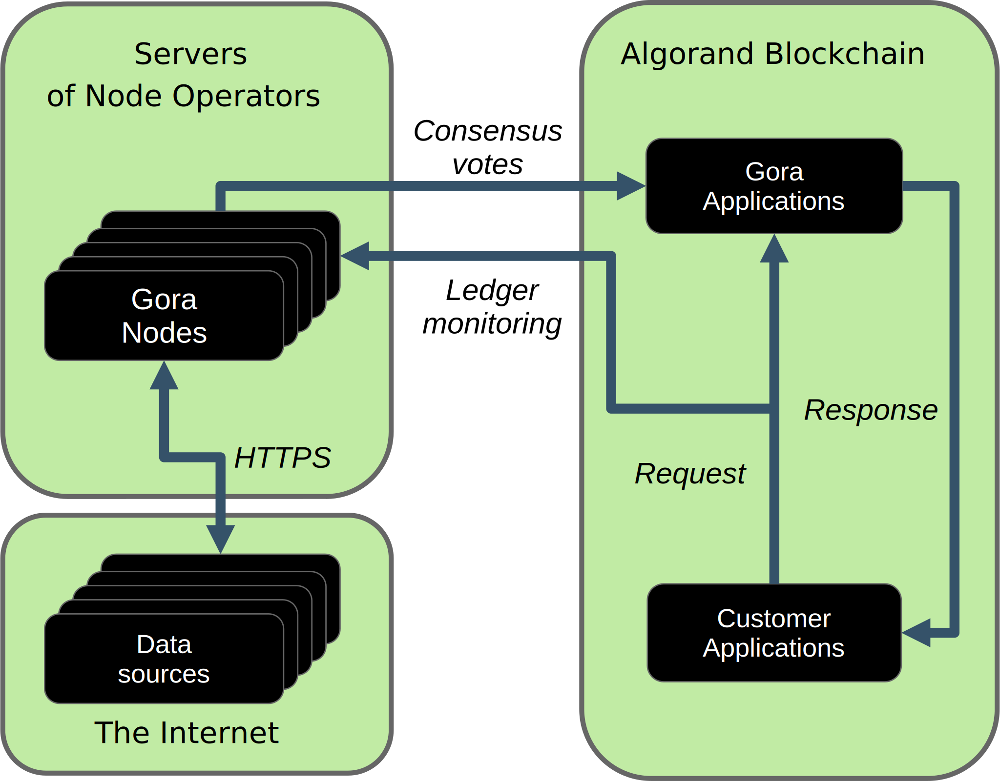
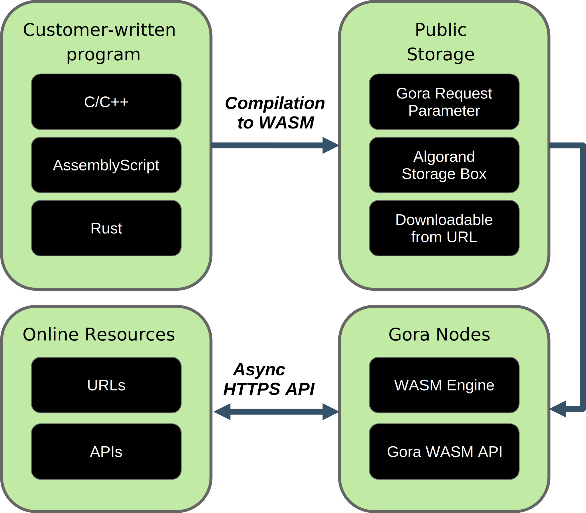

## About Gora

[Gora](https://gora.io/ "Gora official website") enables blockchain programs
(smart contracts) to interact with the outside world. Getting financial
information from high-quality providers, extracting arbitrary data from public
pages, calling online APIs or running Web Assembly code off-chain - is all made
possible by Gora. To maintain security and trust, Gora relies on
decentralization. A network of independent Gora nodes executes requested
operations in parallel and certifies the outcome via reliable consensus
procedure.

This document is aimed at developers working with Gora-enabled blockchains or
companies interested in adding Gora capabilities to a blockchain they manage.
Its main focus is developer experience and technical description of the current
Gora offering. For help on running Gora nodes or using Gora on Algorand
platform, please refer to Gora legacy documentation.

|**Gora structure and workflow overview**|
|:--:|
||

## Developing applications with Gora

Customer applications interact with Gora by calling Gora smart contracts. On
EVM-compatible networks, smart contracts are almost always written in
[Solidity](https://soliditylang.org/), so this is the language we use in our
documentation and examples. For a quick hands-on introduction to using Gora,
see [Usage examples](https://github.com/GoraNetwork/phoenix-examples/).
For a more complete overview as well as an API reference, read on.

### Calling Gora

Gora functionality is accessed by calling *methods* of Gora *main smart
contract*. To get started, you need Gora main contract address for the
blockchain network that you are going to use. The preferred way to find it is to
check the home page of Gora Explorer for the network in question. For example,
[Gora Explorer for Base mainnet](https://mainnet.base.explorer.gora.io/). Gora
main contract address is shown next to "Gora App" label.

With Gora main contract address, you can create a Gora API Solidity object
in your smart contract and start making Gora calls. For example, read total
amount of tokens currently staked in this Gora network:

```
  address constant goraMainAddr = address(0xaaaaaaaaaaaaaaaaaaaaaaaaaaaaaaaaaaaaaaaa);
  Gora gora = Gora(goraMainAddr);
  uint totalStake = gora.totalStake();
```
*The above is an excerpt, for a complete working example see [Usage examples](https://github.com/GoraNetwork/phoenix-examples/)*.

### Requesting oracle data

Oracle data is requested from Gora by calling `request` method of Gora main smart
contract. In its simplest form, it takes the following positional arguments:

|Argument #    |ABI Type           |Description
|--------------|-------------------|------------------------------------------|
| 0            |`uint`             |Request type                              |
| 1            |`string`           |Data source specification                 |
| 2            |`string`           |Value extraction expression               |
| 3            |`string`           |Destination specification                 |

For example:
```
bytes32 reqId = gora.request(4, "http://example.com/mydata", "substr:0,2", "myMethod")
```
More precisely, Gora `request` method arguments have the following meanings:

**Request type** - identifies the type of request among types pre-defined by
Gora. Currently only value of `4` ("Simple URL") is recommended for customer
use.

**Data source specification** - specifies the data source and method to access
it. For "Simple URL" requests, it has the structure of a standard URL, e.g.
`http://some-source.example.com/some_data.json`. Besides HTTP(S), request URLs
may use Gora-specific access protocols. For example, `gora://classic/1`
specifies test source that always returns `1`, without querying external
endpoints.

**Value extraction expression** - describes how oracle-returned value is to be
extracted from data provided by the source. For example, with a JSON source that
returns `{ "score": 123 }` one would specify: `jsonpath:$.score`. Gora supports
a number of value extraction options which will be explained in detail below.

**Destination specification** - contains the name of the method in customer's
smart contract to be called with the oracle return value. For "Simple URL"
requests, Gora will always return orale value by calling the same customer's
smart contract that that requested it.

**Return value** of the `request` method is a unique identifier for the
created request. It is necessary to map returned oracle values to requests
when making multiple oracle calls, to manipulate created requests or to access
their properties.

### Receiving oracle data

After your Gora request is created and committed to public blockchain, it should
be picked up and processed by Gora nodes in short order. Data extracted by nodes
according to your specifications will be put through consensus by Gora smart
contracts. On successful verification, Gora main smart contract will call the
method you specified in your request and provide the resulting value. For
"Simple URL" requests, which are considered in this document, your
data-receiving method must only accept two arguments:

|Argument #    |ABI Type           |Description
|--------------|-------------------|------------------------------------------|
| 0            |`bytes32`          |Request ID                                |
| 1            |`bytes`            |Oracle value                              |

Namely:

**Request ID** - identifier of Gora request for which the value provided is the
response. You smart contract will likely want to use it to determine which of
the Gora requests made previously this response applies to.

**Oracle value** - value returned by the oracle, as a byte string. For "Simple
URL" requests, numeric values will be provided as their string representaitons,
e.g. "0.1234", "-12". It will be down to receiving smart contract to convert
them to Solidity numeric types if they need. Strings are returned as is.

### Data extraction specifications

Gora users most often want a specific piece of data source output, so they must
be able to tell Gora how to extract it. This is what a Gora data extraction
specification does. It consists of up to three parts, separated by colon:
method, expression and an optional rounding modifier. For example, `substr:4,11`
tells Gora that it needs to return a substring from data source output, starting
at 4th and ending at 11th character. Gora supports the following data extraction
methods and expression formats:

 * `jsonpath`: JSONPath expression, see: https://datatracker.ietf.org/doc/draft-ietf-jsonpath-base/
 * `xpath`: XPath expression, see: https://www.w3.org/TR/2017/REC-xpath-31-20170321/
 * `regex`: JavaScript regular expression, see: https://developer.mozilla.org/en-US/docs/Web/JavaScript/Guide/Regular_Expressions
 * `substr`: substring specification, start and end offsets, e.g. `substr:4,11`
 * `bytes`: same as substr, but operates on bytes rather than characters

An optional rounding modifier is used to round floating-point values to certain
amount of digits after the point. This may be necessary with some types of
values such as cryptocurrency exchange rates. They can be so volatile that
different Gora nodes are likely to get slightly different results despite
querying them at almost the same time. That would prevent the nodes from
achieving consensus and confirming the value as authentic. Adequate rounding
gets us around this issue.

For example, if you specify `jsonpath:$.rate:3`, the responses
`{ "rate": 1.2345 }` and `{ "rate": 1.2344 }` that may be received by different
Gora nodes will yield the same value `"1.234"`. The nodes will achieve consensus
and you will get `"1.234"` as the resulting oracle value. Rounding only affects
fractional part of the rounded number, all whole part digits are preserved.
For example, if rounding parameter is set to `7`, the number `123890.7251`
will be rounded to `123890.7`, but the number `98765430` will remain unaffected.

### Using off-chain computation

|**Gora off-chain computation workflow**|
|:--:|
||

For use cases that require more flexibility, Gora supports oracle requests that
execute user-supplied [Web Assembly](https://webassembly.org/) to produce an
oracle value. This enables querying of data sources determined at runtime and
processing their outputs in arbitrary ways. The user-supplied code is executed
off-chain by Gora nodes and is subject to resource limits.

To make use of this feature, developers must write their off-chain programs
using Gora off-chain API in any language that compiles to Web Assembly. Compiled
binary is then encoded as `Base64` and included with the request to a special URL
as parameter named "inline". For example:
```
gora://offchain?inline=AGFzbQEAAAABhoCAgAABYAF/AX8CuoCAgAACA2Vudg9fX2xpbmVhcl9tZW1vcnkCAAEDZW52GV9faW5kaXJlY3RfZnVuY3Rpb25fdGFibGUBcAAAA4KAgIAAAQAHjICAgAABCGdvcmFNYWluAAAMgYCAgAABCpGAgIAAAQ8AIABBgICAgAA2AghBAAsLk4CAgAABAEEACw1IZWxsbyB3b3JsZCEAAMKAgIAAB2xpbmtpbmcCCJuAgIAAAgCkAQAJZ29yYV9tYWluAQIGLkwuc3RyAAANBZKAgIAAAQ4ucm9kYXRhLi5MLnN0cgABAJGAgIAACnJlbG9jLkNPREUFAQQGAQAApoCAgAAJcHJvZHVjZXJzAQxwcm9jZXNzZWQtYnkBBWNsYW5nBjE2LjAuNgCsgICAAA90YXJnZXRfZmVhdHVyZXMCKw9tdXRhYmxlLWdsb2JhbHMrCHNpZ24tZXh0
```

Base64 encoding of files can normally be done from Linux or MacOs command line:
```
$ base64 example_off_chain_basic.wasm
AGFzbQEAAAABhoCAgAABYAF/AX8CuoCAgAACA2Vudg9fX2xpbmVhcl9tZW1vcnkCAAEDZW52GV9f
aW5kaXJlY3RfZnVuY3Rpb25fdGFibGUBcAAAA4KAgIAAAQAHjICAgAABCGdvcmFNYWluAAAMgYCA
gAABCpGAgIAAAQ8AIABBgICAgAA2AghBAAsLk4CAgAABAEEACw1IZWxsbyB3b3JsZCEAAMKAgIAA
B2xpbmtpbmcCCJuAgIAAAgCkAQAJZ29yYV9tYWluAQIGLkwuc3RyAAANBZKAgIAAAQ4ucm9kYXRh
Li5MLnN0cgABAJGAgIAACnJlbG9jLkNPREUFAQQGAQAApoCAgAAJcHJvZHVjZXJzAQxwcm9jZXNz
ZWQtYnkBBWNsYW5nBjE2LjAuNgCsgICAAA90YXJnZXRfZmVhdHVyZXMCKw9tdXRhYmxlLWdsb2Jh
bHMrCHNpZ24tZXh0
$
```
To reduce blockchain storage use, you can apply Gzip compression before
encoding: `gzip < example_off_chain_basic.wasm | base64`. Gora will automatically
recognize and decompress gzipped Web Assembly binaries.

### Gora Off-chain computation API

Web Assembly programs that you supply with Gora off-chain computation requests
interact with host Gora nodes via a simple API. It provides functions to setup
and initiate HTTP(s) requests, or write log messages. It also includes a
persistent data structure to share data with the host node or between *steps* of
your program. *Steps* are essentially repeated executions of the program in
course of serving the same off-chain computation request. They are necessary
because Web Assembly programs cannot efficiently pause while waiting to receive
data from external sources such as network connections.

A *step* starts when the program's *main function* is called by the executing
Gora node and ends when this function returns. During a step, the program can
schedule HTTP(S) requests, possibly using URL templates that it can fill at run
time. When the step ends, these requests are executed by the Gora node. On
their completion, the next step commences and your program can access request
results as well as other data provided by the Gora node via current *context*
structure. The *context* persists for the duration of executing your off-chain
computation request.

Finishing a step, the program returns a value which tells the Gora node what to
do next: execute another step, finish successfully or terminate with a specific
error code. For the list of valid return values, see [`gora_off_chain.h`](https://github.com/GoraNetwork/phoenix-examples/blob/main/gora_off_chain.h).
header file. For a hands-on introduction to Gora Off-Chain API and execution
model, please see [Usage examples](https://github.com/GoraNetwork/phoenix-examples/).
