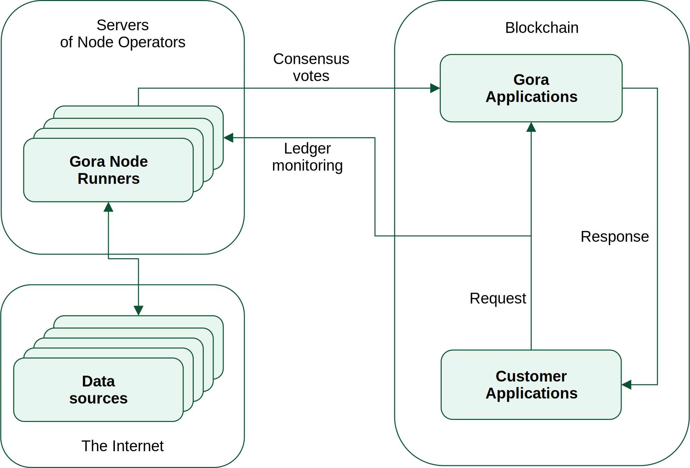

.. role:: js(code)
   :language: javascript

.. contents::

##########
About Gora
##########

   Gora general structure and workflow

`Gora <https://gora.io/>`_ enables blockchain programs (smart contracts) to
interact with the outside world. Getting financial information from high-quality
providers, extracting arbitrary data from public pages, calling online APIs or
running Web Assembly code off-chain - is all made possible by Gora. To maintain
security and trust, Gora relies on decentralization. A network of independent
Gora nodes executes requested operations in parallel and certifies the outcome
via reliable consensus procedure.

This document is aimed at developers working with Gora-enabled blockchains or
companies interested in adding Gora capabilities to a blockchain they manage.
Its main focus is developer experience and technical description of current
Gora offering. For help on using Gora on `Algorand <https://algorand.org/>`_,
please refer to Gora legacy documentation.

.. include:: setting_up_network.rst
.. include:: developing_applications.rst
