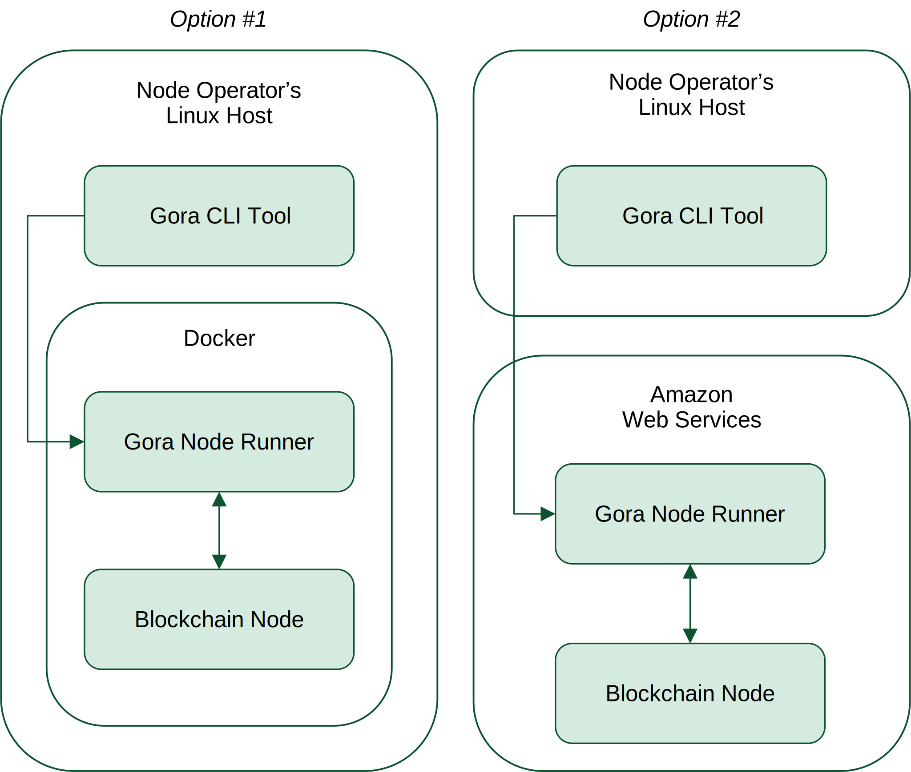

.. _Docker: https://docker.io/
.. _AWS: https://aws.amazon.com/
.. _AWS CLI: https://docs.aws.amazon.com/cli/latest/userguide/getting-started-install.html
.. _Gora CLI tool: https://download.gora.io/

###############################
Setting up a Gora node network
###############################

Gora is a *decentralized* blockchain oracle. To produce its values, it relies on
a network of independent blockchain-connected nodes running *Gora Node Runner
(GNR)*. Gora token issuance and distribution, required to bootstrap consensus
verification, are usually done once by the network owner and are beyond the
scope of this discussion. For the purposes of this document, setting up a Gora
node network comes down to setting up GNR for each node operator.

The GNR is distributed as a Linux-based `Docker`_ image that runs on any
docker-enabled customer host or in Amazon cloud as an `AWS Fargate <https://aws.amazon.com/fargate/>`_
application. GNR is managed via `Gora CLI tool`_ - a self-contained command-line
executable that encapsulates all required functionality for Gora node operators
or power users.

*************
Prerequisites
*************

To become a Gora node operator, one should possess the following:

- Ability to work with command-line (CLI) tools and Linux OS in general.
  Advanced customization may require editing of text files in JSON format. If
  you are not comfortable with the above, it is recommended that you enlist
  professional help or get up to speed using resources widely available online.

- A 64-bit x86 Linux host with `Docker`_ installed, or an `AWS`_ account. Gora
  software is not thoroughly tested on Mac OS at this time, but some users
  reported success with Linux instrucitons, so others are welcome to follow them
  at their own risk.

- Access to a live API node for each blockchain network they are going to
  support. Gora serves multiple blockchains, so access options vary per chain.
  Some are listed in Appendix 1 at the end of this document. In any case, you
  can run a blockchain node yourself which many Gora node operators do.

- A funded blockchain account with a wallet connected to it for each supported
  blockchain network. It is used for opting into Gora applications, receiving
  Gora tokens and staking them.

***************************
Installing Gora Node Runner
***************************

============================
1) Install required software
============================

* Install `Docker`_  engine if you want to run your node locally, or `AWS CLI`_
  if you prefer to run it on `AWS`_. When choosing Docker, ensure that you are
  able to use it as a normal, *non-root user*; normally this requires adding
  yourself to the ``docker`` group, then logging out and back in.

* Download `Gora CLI tool`_. To do it with ``wget`` utility run:
  ``wget https://download.gora.io/latest-release/linux/gora -O gora``

* Make the downloaded binary executable by running `chmod u+x ./gora`

===============================
2) Initialize your installation
===============================

To kick off the initialization process, run `./gora init`. You will be guided
through the steps with prompts and messages. You can abort the process at any
time by pressing `Ctrl-C`. During initialization, Gora CLI tool will:

* Create your Gora *participation accounts* on the selected blockchains.
* For blockchains that require it, link your participation and main accounts,
  and supply it with Gora tokens and currency.
* Create ``~/.gora`` configuration file with info on used accounts as well
  as access details for blockcians API nodes that your Gora node will use.

To start over, rename or delete the produced config file ``~/.gora``.

.. warning:: **WARNING!** **At no time should you run Gora software as root**. If
             hacked, a program executed with root priveleges becomes a gateway
             to complete control of your system.  This makes such software a
             high-priority target for hackers, which is neither in Gora's
             interest nor yours. **No support will be provided for such usage
             scenarios.**

             If you run into a permissions issue, **do NOT use sudo** to
             force your way through. For docker-related errors, make sure you
             have added yourself to ``docker`` user group. When adding priveleges
             to your normal user account is undesirable, create a new user
             (e.g. ``gora``) with ``useradd`` command, give it the necessary
             permissions and perform all Gora-related operations as that user.

================================
3a) Start your Gora node locally
================================

Before continuing, make sure that you have installed Docker and *added yourself
to the `docker` group* on your host. To start your node, execute:
``./gora docker-start``.  When run for the first time, it will pull GNR docker
image from Gora docker registry. As the node launches, it starts logging its
progress to standard output, e.g.:

.. parsed-literal::
   :class: terminal

   2024-10-04T11:19:57.613Z INFO  Starting Gora Node Runner
   2024-10-04T11:19:57.984Z INFO  Version: "1.1.65"
   2024-10-04T11:19:57.984Z INFO  Built on: "Sat, 02 Nov 2024 02:54:17 GMT"
   2024-10-04T11:19:57.984Z INFO  Revision: "f9e66e7918f43326974d7ac345bec4bee734a0df"
   2024-10-04T11:19:57.984Z INFO  Smart contracts revision: "ac9e053d68dd6718c02ed36b76cd9ba478a390bb"
   2024-10-04T11:19:57.984Z INFO  Docker image: "107782235753.dkr.ecr.eu-central-1.amazonaws.com/gora-nr:v1.1.65"
   2024-10-04T11:19:57.985Z INFO  Docker image hash: "dd20b9d55e7081687b3cacfba9d1e93a49e924c4e8e7a582cbedc86b6285c55d"
   2024-11-04T11:19:58.951Z INFO  EVM network "baseMainnet" enabled, chain Id "8453", main contract "Gora" at "0xd4c99F88095F32dF993030d9a6080e3BE723F617"
   2024-10-04T11:20:01.020Z INFO  Waiting for next oracle request

To make the node switch into background upon startup, add ``--background`` to
the command.  For a quick check of instance's status, use ``gora docker-status``.
To inspect instance's logs, use docker log command, e.g.:
``docker logs -fn 100 gora-nr``.

================================
3b) Start your Gora Node on AWS
================================

.. note:: *AWS functionality is currently* **experimental**, *new users are
          encouraged to run their nodes locally*. *If you are willing to try
          running on AWS, execute* ``export GORA_EXPERIMENTAL_MODE=1`` *and
          proceed with caution.*

Running your Gora node on AWS is a lower maintenance option, altough it is not
as flexible or economical as running it locally. To begin, download and install
`AWS CLI`_. You should then be able start your Gora node right away by running
``./gora aws-start``.  During a first-time execution, several AWS configuration
items will be set up for you, producing an output like:

.. parsed-literal::
   :class: terminal

   Creating security group "gora-nr-sg"
   Creating log group "gora-nr-logs"
   Registering task definition "gora-nr-task"

Then you should see the kind of output that would appear every time you start
your AWS Gora node up:

.. parsed-literal::
   :class: terminal

   Startup initiated, task ID: "2468d56dff884c9ca536fb2e537f8928"

This means that AWS has been asked to start your node up and it should be online
shortly. You can check its current status by executing ``./gora aws-status`` which
should eventually produce an output like:

.. parsed-literal::
   :class: terminal

   State: Running
   Started at: 2022-07-04T17:33:08.803Z
   Uptime: 2 min.
   Task ID: "2468d56dff884c9ca536fb2e537f8928"

This confirms your Gora node has been started by AWS. To check up on it, you
can always inspect its logs via AWS web UI or by running ``./gora aws-log``.

======================
4) Stop your Gora node
======================

To stop a Gora node running locally in the foreground, hit ``Ctrl-C``. If it is
running in the background, execute ``./gora docker-stop``. To stop a node on AWS,
run ``./gora aws-stop``.

*****************************************
Updating or moving your Gora installation
*****************************************

Gora CLI tool is updated with ``gora update`` command. It checks whether there is
a more recent version than the one being run, and if so, offers to upgrade it by
downloading and replacing the ``gora`` binary. Current binary will be backed up.
GNR is distributed as a docker image, so it will be automatically updated
whenever your Gora node is started. To ensure that you are running the latest
version, simply stop and start your node again.

Your can move your Gora installation to a new server without setting it up from
scratch. Copy the ``gora`` binary to a new location of your choice and ``~/.gora``
configuration file to your home directory on the new server. Make sure you have
Docker installed and enabled for the user that runs Gora node on the new server
as well. When you start your node for the first time at the new location, it may
take some time to fetch the GNR docker image. Make sure not to run multiple nodes
off the same configuration at the same time.

***********************
Gora node configuration
***********************

A Gora node configuration is defined by the blockchain accounts it is linked to
as well as various customizations via configuration variables. These are set
during the initialization process described above and usually do not need to
change. But for basic troubleshooting or developer customization purposes, here
is an overview.

Gora config file contains settings specific to your Gora node in JSON format.
When deploying a node to cloud or launching it locally, Gora CLI tool reads this
file and passes its contents to GNR via Docker container environment settings.
This makes local configuration available to GNR without using docker mounts.
The default location of Gora config file is ``~/.gora``.
